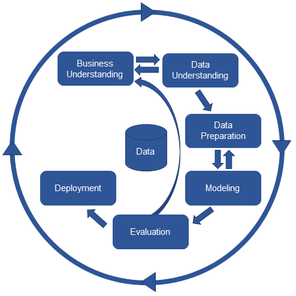

# Health insurance cross-sell

## 1. Introduction
This is an end-to-end data science project which a classification algorithm was used to rank the first country of destination of a new user.

# 2. Business Problem.

Airbnb would like to know which country of destination a new user will book so the company could share more personalized content with their communitiy, better forecast demand and decrease average time to first booking.

# 3. Business Assumptions.

* No destination Found (NDF) is also a possible outcome for the problem, which means that model did not found yet which country of destination a new user will book.
* In the column date_first_booking, we considered that the date of this first booking would be the same of the date the users create their account in case the user did not make their first booking yet.
* In first_affiliate_tracked column, we fill no values as 'untracked'.
* In gender column, we replace 'other' answer for 'unknown'
* We discard age above 90 and below 15 years old.

# 4. Tools used
* Python
* Jupyter Lab
* Git and Github
* Flask and Python API's
* Sklearn

# 5. Dataset

Dataset contains 213,415 rows and 16 columns and it contains the following variables:

* id - Unique ID for the customer

* Gender - 	Gender of the customer

* Age -	Age of the customer

* date_account_created

* timestamp_first_active - timestamp of the first activity, note that it can be earlier than date_account_created or date_first_booking because a user can search before signing up

* date_first_booking - date of first booking

* signup_method

* signup_flow: the page a user came to signup up from

* language: international language preference

* affiliate_channel: what kind of paid marketing

* affiliate_provider: where the marketing is e.g. google, craigslist, other

* first_affiliate_tracked: whats the first marketing the user interacted with before the signing up

* signup_app - Which place the account was created (web, iOS, Android,Mobile web)

* first_device_type

* first_browser

* country_destination - 12 possible outcomes of the destination country: 'US', 'FR', 'CA', 'GB', 'ES', 'IT', 'PT', 'NL','DE', 'AU', 'NDF' (no destination found), and 'other'.

# 6. Solution Strategy

My strategy to solve this challenge was:

This project was developed following CRISP-DM (Cross-Industry Standard Process - Data Science) framework. This framework has these steps:

* Business Understanding;
* Data Collection;
* Data Cleaning;
* Exploratory Data Analysis (EDA);
* Data Preparation;
* Machine Learning Modelling and fine-tuning;
* Model and Business performance evaluation / Results;
* Model deployment.

**Step 1. Data description and cleaning:** Seeing dimensions of data, checking existence of NAs, number of rows and columns. Fillout NAs, altering columns names,  Descriptive statistics.

**Step 2. Feature engineering**: Creation of a mindmap hypothesis with all variables and values that could have impact on sales. After that, some features was created from current ones

**Step 3. Exploratory Data Analysis (EDA)**: Univariate, bivariate and multivariate analysis. Checking correlation between response variable and explanatory ones. Hypothesis testing.

**Step 4. Data preparation**: Rescaling and encoding features so they could be used in machine learning algorithms properly.  Transformation of response variable

**Step 6. Feature selection**: Selecting the most important features to predict sales through Boruta algorithm, feature importance and permutation importance. Also there is a split in dataset creating train and test data.

**Step 7. Machine learning modelling**: Testing machine learning algorithm to find out which one has best performance in prediction. Performance was evaluated using cross-validation.

**Step 8. Hyperparameter tunning**: Random search technique was used to find out the best hyperparameters that maximizes performance of choosen model in last step.

**Step 9. Translation of modelling performance in business performance**: Modelling performance was analyzed in a business perspective.

**Step 10. Deploy mode to production**: Model was deployed in a cloud environment so stakeholders could have access to predictions.

# 7. Top 3 Data Insights

## **Hypothesis 01:** The proportion of customers with more than 40 years old and booked to US is 10% higher than customers with more than 40 years old and booked to outside U.S.

**True/False:** False. Actually the proportion of customers with more than 40 years old and booked to U.S is 9% lesser than customers with more than 40 years old and booked outside U.S.

**Hypothesis 02:** The proportion of customers who use Firefox and booked to outside U.S is 10% higher than users who use Google Chrome.

**True/False:** The proportion of customers who uses Google Chrome and booked to outside U.S is almost double of firefox users.

**Hypothesis 03:**  The average number of days to make the first booking after account creation for users who booked outside U.S is 15% higher than for users who booked to U.S

**True/False:** False. The average number of days to make first booking after account creation is 8% higher in customers who booked to U.S.

# 8. Machine Learning Model Applied and performance
Four classification models were tested: XGBoost, Random Forest, LGBM and KNN. The company choosen the Normalized Discount Cumulative Gain (NDCG) to evaluate model performance. In the table below has the performance of all fours models, including Kappa score and their cross-validation results as well. The XGBoost performed better than other models as one can see in table below. 

It was chosen XGBoost model and below one can see its performance with hiperparameters tuned.

# 9. Business Results
It is possible to simulate some scenarios based on the capacity of the company to make contact with clients, since there are some costs in archieving them.

if the company could just contacting 30% of all their clients (assume this percetage is 20,000 clients), the model will rank the clients with best probability of getting the car insurance and approximately 70% (14,000) of these chosen clients would be interested in acquiring the car insurance.

# 10. Conclusions

The model did a good job in selecting clients for the company to make a cross-sell sale. It helps company reduce its costs of contacting a client as it will be more selective in which clients it should contact. Also the model would increase company revenue as they would select probably clients to acquire its car insurance.

# 11. Next Steps to Improve

The next CRISP-DM circle one can do the following:

* Trying to get more features about the client as their income, number of family members, their jobs.
* Trying to get more features about their cars, how many cars they have for instance.
* Training another models such as LightGBM and Support Vector Machine (SVM) to check whether performance could be improved.

# 9. Lessons Learned

# 10. Next Steps to Improve

